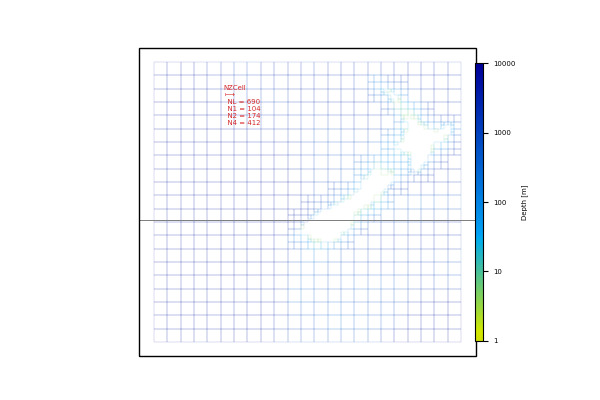

SMC Python Tools
================

This repository contains tools to generate and work with Spherical-Multi-Cell
(SMC) grids for WAVEWATCH III.  Code is based in large part from existing bits
and pieces that have been cobbled together into a common library and modified.
Tools provided here are very much a work in progress, and are in various stages
of completeness. 

The main python class::

    SMCPy/         - Main python class for creating SMC grids
    SMCPy/fortran/ - Fortran code for generating face arrays
    SMCPy/matlab/  - Matlab gridgen code for generating bathy
    examples/      - Examples of how this library is used

Other bits and pieces::
    
    smc            - Python code for generating plots from smc flat output files
    idl            - IDL scripts for producing SMC grids
    bathy          - C code to produce bathymetry
    ww3_src        - Alterations to ww3 code (TODO)

Install
--------

Generate python modules from fortran code (required f2py)::

    cd SMCPY/fortran
    ./generate_fpys.sh
    cd ../..

Standard pip install from there, or developer install as follows::

    pip install --user -e .

Contributors::

    Tom Durrant (MetOcean)
    Jian-Guo (UKMO)
    Chris Bunny (UKMO)
    Andy Saulter Bunny (UKMO)
    Qingxiang Liu (University of Melbourne)

Example
--------

Simple example showing a 1 deg NZ grid refining down to 0.25 based on a depth of 250m

